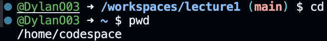
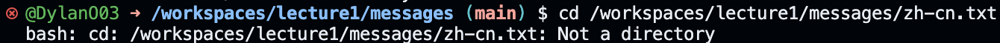

# Lab Report 1 Blog

The absolute path was: `/workspaces/lecture1`
This was the output since cd with no arguments sets the directory to the home directory if there is one.

The absolute path was: `/home/codespace`
This was the output since cd with a path to directory sets the new directory has the working one.

The absolute path was: `/workspaces/lecture1/messages`
This was the output since cd with a path to a file makes an error since a file is not a directory.

The absolute path was: `/workspaces/lecture1`
This was the output since ls with no arguments lists all the files in the working directory.

The absolute path was: `/workspaces/lecture1`
This was the output since ls with a path to directory lists all the files in the directory.

The absolute path was: `/workspaces/lecture1`
This was the output since ls with a path to a file outputs the path of the given file.

The absolute path was: `/workspaces/lecture1`
This was the output since cat with no arguments awaits an input to output and does so until you save the file.

The absolute path was: `/workspaces/lecture1`
This was the output since cat with a path to directory makes an error as cat works with files.

The absolute path was: `/workspaces/lecture1`
This was the output since cat with a path to a file outputs the contents of the file.
